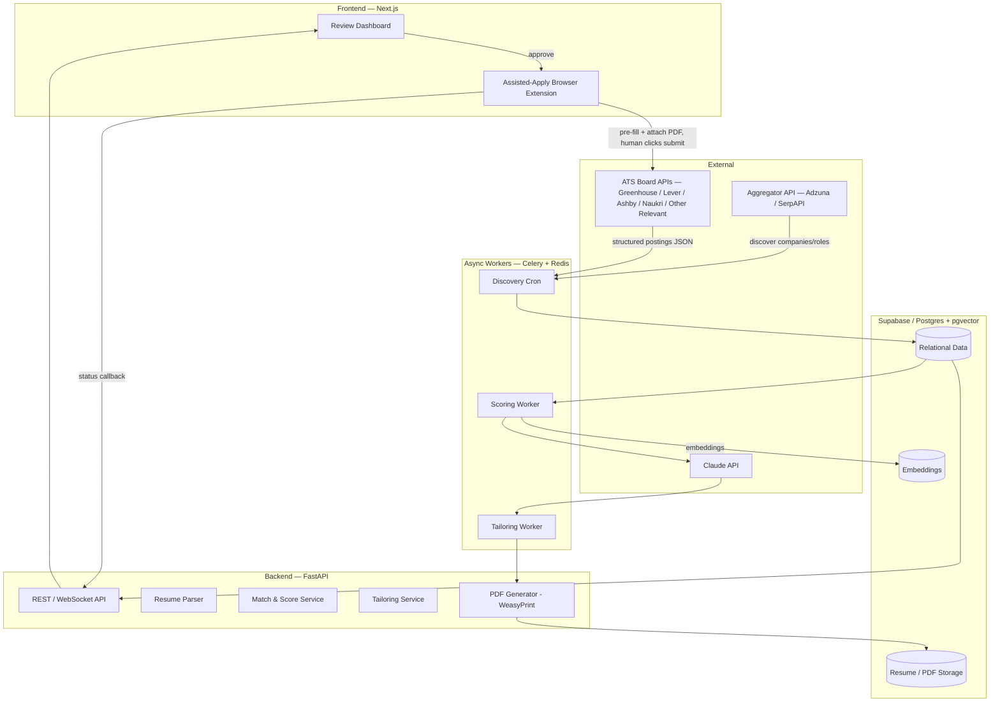
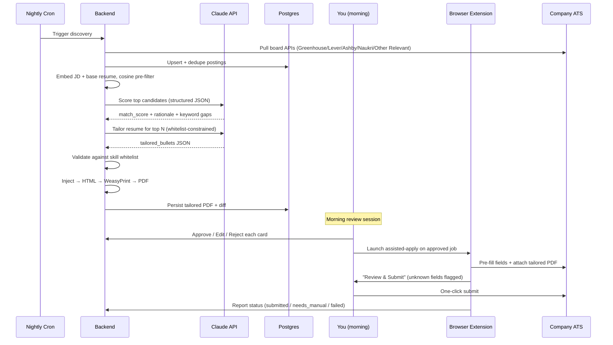

# PRD — Job-Hunt Assist Platform ("JobPilot")

**Author:** Senior Technical PM / Systems Architect
**Status:** Draft v1.0
**Owner:** Single user (personal internal tool)
**Last updated:** 2026-07-24

---

## 0. TL;DR / What changed from the original brief

This PRD keeps ~80% of the original design (ATS standardization, human-in-the-loop, no-hallucination tailoring, queue-based backend). It makes **two deliberate architectural changes**, both because they lower legal/ban risk *and* make the system materially more robust:

| Stage | Original brief | This PRD | Why |
|---|---|---|---|
| **Job discovery** | Scrape aggregators + bypass Cloudflare | Pull from **public ATS board APIs** (Greenhouse / Lever / Ashby / Naukri / Other Relevant) + aggregator API for *discovery only* | These ATS APIs are documented and return structured JSON. No browser, no proxies, no ban risk — a strictly better foundation. |
| **Application execution** | Fully headless auto-submit behind **residential proxies / bot-detection bypass** | **Assisted-apply**: pre-fill every field + attach tailored PDF in *your own logged-in browser session*, one-click review-and-submit | Evading anti-bot controls at scale is a ToS/legal minefield and is *self-defeating* — the value prop collapses the instant your fingerprint is flagged. Assisted mode is un-bannable and robust to DOM changes because you are the fallback. |

**One strategic note:** "50 applications/day" is a volume metric. In a market saturated with AI-generated applications, ATS keyword filters and recruiters increasingly penalize obvious automation, so raw submission count is the wrong thing to optimize. This PRD reframes success around **response rate** and **time-per-quality-application**, and treats daily volume as a *bounded dial*, not a maximization target. The tool's job is to remove the drudgery (typing your GitHub URL 50 times), not to carpet-bomb.

---

## 1. Problem & Objective

**User:** Software engineer, ~1.5 YOE, targeting SWE roles in India + Remote (startups and MNCs).

**Pain:** Applying to relevant roles is high-volume, repetitive manual labor — the same fields, re-tailoring the same resume, re-uploading PDFs across dozens of portals.

**Objective:** Cut the human time per *quality* application from ~10–15 min to **< 2 min**, while keeping every submission accurate, non-fabricated, and reviewed by a human before it goes out.

### Success metrics

| Metric | Target | Notes |
|---|---|---|
| Human time per submitted application | < 2 min | Primary efficiency metric |
| Recruiter response rate (reply / screen invite) | Beat the user's manual baseline | Primary outcome metric — measure this, not volume |
| Tailoring hallucination rate | 0% | Guardrail: automated skill-whitelist check must pass |
| Applications requiring manual field completion | Tracked, trending down | Drives ATS field-mapping coverage work |
| Discovery precision (relevant / total surfaced) | > 70% | Keeps the review queue signal-heavy |

### Non-goals

- Not a mass-spam engine. Volume is capped and paced.
- Not scraping or evading LinkedIn / Indeed application flows (the original brief correctly flagged avoiding these).
- Not auto-answering behavioral/essay screening questions on your behalf without review.
- Not solving CAPTCHAs or spoofing browser fingerprints.

---

## 2. High-Level Architecture



**Key architectural principle:** *Discovery and tailoring are fully automated and headless (pure HTTP + LLM). Only the final submission touches a browser — and it runs in the user's own authenticated session with the user present.* This is what removes both the bot-detection problem and the "50 concurrent Playwright sessions will crash the server" problem.

---

## 3. The Daily Pipeline



---

## 4. Component Specifications

### 4.1 Profile & Resume Ingestion

**Input:** base resume (PDF or text) + explicit structured profile.

**Processing:**
- Parse PDF text with a library like `pdfplumber` (layout-aware) or `unstructured`.
- Ask the LLM to extract a **canonical, immutable facts object** from the parsed resume, which the user then confirms/edits once:

```json
{
  "identity": { "name": "...", "email": "...", "phone": "...", "location": "..." },
  "links": { "linkedin": "...", "github": "...", "portfolio": "..." },
  "experience_years": 1.5,
  "skills": ["React", "Node.js", "Python", "PostgreSQL", "..."],
  "employment": [
    { "company": "...", "title": "...", "start": "2024-01", "end": "present",
      "bullets": ["...", "..."] }
  ],
  "education": [ { "degree": "...", "institution": "...", "year": "..." } ]
}
```

**Why "immutable":** this object is the single source of truth. The tailoring engine may *rephrase and re-emphasize* what's in it, but the `skills`, `experience_years`, dates, and titles are treated as a locked whitelist (see §4.4). This is the mechanism that enforces "never hallucinate."

---

### 4.2 Job Discovery (no scraping, no evasion)

**Two-tier approach:**

1. **Discover** which companies/roles exist via an aggregator API:
   - **Adzuna API** (has India coverage) and/or **SerpAPI Google Jobs** to find relevant openings by role + location.
2. **Resolve to structured data** via the ATS board APIs — these are public, documented, and return clean JSON (no auth, no browser):
   - **Greenhouse:** `GET https://boards-api.greenhouse.io/v1/boards/{board_token}/jobs` and `.../jobs/{id}?content=true` for full descriptions.
   - **Lever:** `GET https://api.lever.co/v0/postings/{company}?mode=json`.
   - **Ashby:** `GET https://api.ashbyhq.com/posting-api/job-board/{org_slug}` (increasingly common in startups).
   - **Naukri:** `GET https://api.naukri.com/postings/{company}` (need to check auth requirements, this may not be public).
   - **Other Relevant:**
   - **Workday:** deprioritize — no clean public board API, per-tenant flows, high maintenance. Flag as V2+.

**Pipeline steps:**
- Maintain a growing registry of `{company → ats_provider, board_token}` (seeded manually + auto-discovered from aggregator result URLs).
- Nightly cron pulls each board, upserts postings, **dedupes** by `(company, title, location, ats_job_id)` + a content hash.
- Apply hard filters (location ∈ {India, Remote}, role keywords, seniority ≈ junior/mid, posting age).

**Why this is better than the original scrape plan:** you get structured fields (title, location, department, full description, apply URL) legitimately. The "DOM volatility" risk for *discovery* disappears entirely — you're reading APIs, not parsing HTML.

---

### 4.3 Matching & Scoring

- **Cheap pre-filter (deterministic):** embed each JD and the base resume (`pgvector` in Supabase; use an embeddings model), rank by cosine similarity, drop the long tail. This keeps LLM cost down by only scoring plausible matches.
- **LLM scoring (structured):** for survivors, ask Claude for a strict-JSON verdict:

```json
{
  "match_score": 0-100,
  "must_have_coverage": ["React ✓", "Kubernetes ✗"],
  "keyword_gaps": ["gRPC", "AWS"],
  "seniority_fit": "good | stretch | mismatch",
  "recommendation": "tailor | skip",
  "rationale": "one-paragraph explanation"
}
```

- Only jobs above a configurable `match_score` threshold proceed to tailoring. This is where the queue is naturally bounded well below "carpet-bomb" levels.

---

### 4.4 AI Tailoring Engine (with hard anti-hallucination guardrails)

**Model recommendation:** the original brief cites *Claude 3.5 Sonnet*, which is outdated. Use the current Claude API — e.g. **Claude Sonnet 5** for cost-efficient, high-adherence structured JSON on the bulk run, and **Claude Opus 4.8** for the top-tier roles where quality matters more than cost. Use the **Message Batches API** for the nightly bulk tailoring pass (roughly half-price for large asynchronous batches), and enforce structure via **tool use / strict JSON schema** rather than free-text parsing. Verify current model IDs and features at https://docs.claude.com/en/api/overview.

**Prompt contract:**
- **Inputs:** the immutable facts object (§4.1) + the JD + the `keyword_gaps` from scoring.
- **Allowed:** reorder and rephrase existing bullets; surface *existing* skills that map to the JD; adjust emphasis and phrasing to mirror the JD's language.
- **Forbidden:** introduce any skill/tool/technology not in `skills`; change `experience_years`, titles, employers, or dates; invent projects or metrics.

**Output schema:**

```json
{
  "summary": "tailored 1-2 line headline",
  "tailored_bullets": [
    { "employment_index": 0, "original": "...", "rewritten": "...",
      "skills_referenced": ["React", "Node.js"] }
  ],
  "skills_ordered_for_this_jd": ["React", "Node.js", "PostgreSQL"]
}
```

**Automated guardrail (the critical bit):** before a tailored resume is ever shown or used, run a deterministic check:
- `set(all skills_referenced) ⊆ set(canonical skills)` → else **reject and re-run**.
- Regex/NER pass to flag any technology token in the rewritten text that is not in the whitelist → flag for human review.
- Assert dates/titles/YOE are byte-identical to the canonical object.

This makes "never lie on the resume" a *system property*, not a hope. It's also the single most important ethical control in the product — it's what keeps this on the right side of "aggressive job search" vs. "fabricated credentials."

**Rendering:** inject the approved JSON into a clean HTML/CSS resume template → **WeasyPrint** → PDF with selectable text (ATS-parseable). Keep the template single-column, standard fonts, no tables-for-layout, so ATS parsers read it correctly.

---

### 4.5 Human-in-the-Loop Review Dashboard

**Layout:** list or Kanban queue of prepared applications.

**Each card shows:**
- Company, role, location, salary (if the ATS/aggregator exposes it), `match_score`.
- **Diff view** of what the AI changed (original bullet → rewritten bullet), so approval is informed and fast.
- Flagged items: any whitelist warning, any custom/essay question detected in the JD.

**Actions:** `Approve` · `Edit` (inline-edit bullets, re-render PDF) · `Reject`.

**Approval → assisted-apply:** approving marks the app ready; launching the extension pre-fills the form (§4.6). Note the deliberate tradeoff vs. the original brief: submission is human-present rather than fully headless. Net human cost stays tiny (a batched "review & submit" session, ~1 click each), and in exchange you get robustness + compliance + zero ban risk.

---

### 4.6 Assisted-Apply Execution

**Mechanism:** a **browser extension** (or Playwright in *headed*, user-driven mode) operating in your own logged-in browser. No proxies, no fingerprint spoofing — it's genuinely your session.

**Declarative field-mapping registry** per ATS (this is what makes it maintainable):

```json
{
  "greenhouse": {
    "first_name": "input#first_name",
    "last_name": "input#last_name",
    "email": "input#email",
    "phone": "input#phone",
    "linkedin": "input[name*='urls[LinkedIn]']",
    "github": "input[name*='urls[GitHub]']",
    "resume_upload": "input[type=file][name*='resume']",
    "custom_question_matcher": "label -> semantic match -> saved answer bank"
  },
  "lever": { "...": "..." },
  "ashby": { "...": "..." }
}
```

**Flow per application:**
1. Open the apply URL in a new tab.
2. Autofill known fields from the canonical profile; attach the tailored PDF.
3. **Custom questions:** attempt to match against a **saved answer bank** (e.g., "Why this company?", visa status, notice period, expected CTC). Unmatched → leave blank + highlight.
4. **Handoff triggers (never bypass):**
   - Unknown *required* field → pause, flag in UI. *(Your original instinct — kept.)*
   - CAPTCHA / bot-check detected → hand fully to the human. The tool never solves or evades these; their presence is precisely the signal that a human should take over.
5. Present a **"Review & Submit"** state. **The human clicks submit.**
6. Report status back: `submitted` / `needs_manual` / `failed` → dashboard + DB.

**Pacing:** cap and space submissions (both to respect rate limits and to avoid looking like a bot). Volume is a configurable dial defaulting *low*, with the recommendation to tune upward only if response rate holds.

---

## 5. Data Model (Postgres sketch)

```sql
users            (id, email, created_at)
profiles         (user_id, canonical_facts jsonb, base_resume_url)
companies        (id, name, ats_provider, board_token, UNIQUE(ats_provider, board_token))
jobs             (id, company_id, ats_job_id, title, location, description,
                  apply_url, salary, content_hash, discovered_at,
                  UNIQUE(company_id, ats_job_id))
job_embeddings   (job_id, embedding vector)          -- pgvector
scores           (id, job_id, match_score, verdict jsonb, scored_at)
tailoring_runs   (id, job_id, output jsonb, whitelist_passed bool,
                  pdf_url, created_at)
applications     (id, job_id, tailoring_run_id, status,     -- queued|approved|submitted|needs_manual|rejected|failed
                  approved_at, submitted_at)
answer_bank      (user_id, question_key, answer_text)       -- for custom questions
events           (id, application_id, type, payload jsonb, ts)  -- audit trail
```

---

## 6. Tool Stack (refined)

| Layer | Tool | Notes vs. original brief |
|---|---|---|
| Frontend | Next.js + Tailwind | Kept |
| Backend | FastAPI (Python) | Kept — best fit for AI SDKs + orchestration |
| DB / Auth / Storage | Supabase (Postgres) **+ pgvector** | Kept; added pgvector for semantic matching |
| Resume parsing | `pdfplumber` / `unstructured` | Added |
| Discovery | ATS board APIs + Adzuna / SerpAPI | Changed: HTTP + JSON, **no scraping/evasion** |
| LLM | **Claude API (Sonnet 5 bulk / Opus 4.8 premium), Batches API, tool-use JSON** | Updated from the outdated "3.5 Sonnet" |
| PDF | WeasyPrint | Kept |
| Queue | Celery + Redis | Kept — for discovery, scoring, tailoring, PDF gen |
| Apply | **Browser extension / headed Playwright** | Changed: assisted, in-session, **no Browserbase / residential proxies** |

---

## 7. Technical Risks & Mitigations

| Risk | Severity | Mitigation |
|---|---|---|
| **Resume fabrication by the LLM** | High (ethical + your credibility) | Immutable facts object + deterministic skill-whitelist check that blocks/re-runs any tailored output introducing new skills or altered dates. |
| **ToS / legal / account-ban exposure** | High | Use documented ATS APIs; submit in your own session; no anti-bot evasion; pace + cap volume. This is why the evasion layer was removed rather than specced. |
| **DOM volatility on apply forms** | Medium | Standardized ATS + declarative field-mapping registry; human handoff on any unmapped required field (fail-safe, not fail-hard). |
| **Custom / essay screening questions** | Medium | Answer bank with semantic matching; unmatched questions flagged for human. Never auto-answered blind. |
| **Discovery precision (noise in queue)** | Medium | Embedding pre-filter + LLM scoring threshold + hard location/seniority filters. |
| **LLM cost at volume** | Low–Med | Cheap embedding pre-filter before any LLM call; Batches API for the nightly run; cheaper model for bulk, premium only for top roles. |
| **Volume-over-quality backfire** | Medium (strategic) | Reframed success metric = response rate; volume is a bounded dial, not maximized. |
| **CAPTCHA on a portal** | Low | Detected → full human handoff. Never solved/bypassed. |

---

## 8. Rollout / Phasing

**Phase 0 — MVP (prove the loop, one ATS):**
- Profile ingestion + canonical facts.
- Greenhouse board API discovery only.
- Embedding + LLM scoring.
- Tailoring + whitelist guardrail + WeasyPrint PDF.
- Dashboard with diff + approve/reject.
- Manual apply (you click the link, use the tailored PDF) — validate quality before automating fill.

**Phase 1 — Assisted apply:**
- Browser extension with Greenhouse field mapping + resume attach.
- Answer bank + custom-question flagging.
- Add Lever + Ashby discovery and mappings.

**Phase 2 — Scale & polish:**
- Aggregator-driven company discovery to auto-grow the registry.
- Response-rate analytics (which tailoring/keywords correlate with replies).
- Pacing controls, richer diff, edit-in-place.
- (Optional, high-effort) Workday support.

---

## 9. Open Questions

1. **Response-rate baseline:** what's your current manual reply rate? Needed to prove the tool actually helps vs. just applying more.
2. **Answer bank scope:** how many recurring custom questions are worth pre-writing (CTC, notice period, visa, "why us")?
3. **Salary data:** most ATS APIs don't expose salary — accept sparse salary fields, or enrich from the aggregator where available?
4. **Extension vs. headed Playwright:** the extension is smoother UX (lives in your normal browser); headed Playwright is faster to build. Which for Phase 1?
5. **Volume dial default:** start at ~10–15/day and tune on response rate before pushing toward the original 50 target?

---

*This document intentionally omits any bot-detection-evasion design. That stage was replaced with an assisted, in-session model that achieves the same goal — near-zero manual form-filling — without the legal, account-ban, and long-term-fragility exposure that evasion introduces.*
